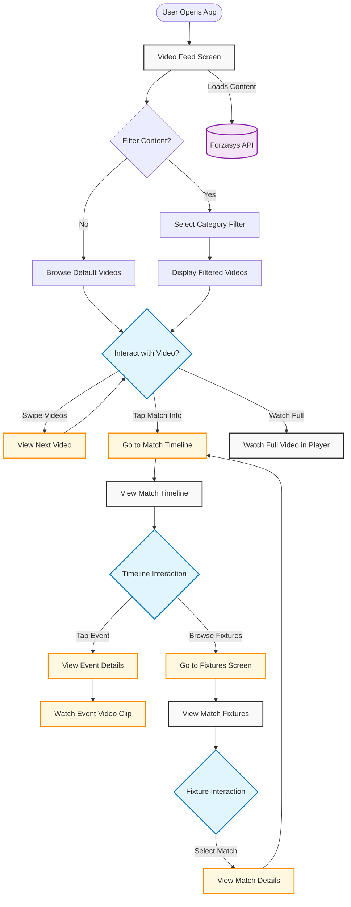

> Why do I have a folder named ".expo" in my project?
The ".expo" folder is created when an Expo project is started using "expo start" command.
> What do the files contain?
- "devices.json": contains information about devices that have recently opened this project. This is used to populate the "Development sessions" list in your development builds.
- "settings.json": contains the server configuration that is used to serve the application manifest.
> Should I commit the ".expo" folder?
No, you should not share the ".expo" folder. It does not contain any information that is relevant for other developers working on the project, it is specific to your machine.
Upon project creation, the ".expo" folder is already added to your ".gitignore" file.


#  ForzaGram

ForzaGram is a mobile application built with **React Native** and **Expo SDK 52**, designed to deliver an engaging and fast way for users to view key football moments. The app fetches video highlight data dynamically from an external API and presents it in a clean, scrollable interface.

With React Native, we achieve a shared codebase for both **iOS** and **Android** platforms. The use of **Expo** enhances the development experience with fast refresh, easy testing, and powerful built-in APIs. This combination makes the app lightweight, responsive, and easy to maintain.

---

##  Features

- Displays short highlight videos (e.g. goals, red/yellow cards, shots)
- Scrollable single-video view
- Metadata display (team, player, event type, time)
- Integration with an external API (via mock Google Sheets in early phase)
- Runs on both Android and iOS
- UI built from design prototypes in Figma

---

##  Prerequisites

Before running the application, make sure the following tools are installed on your machine:

- **Node.js** – Required to run JavaScript code and manage project dependencies via npm.  
  [Download Node.js](https://nodejs.org/en/download)

To simulate the application during development, you’ll also need **at least one** of the following:

- **Android Studio** – Required to launch and run the Android emulator.
- **Xcode** – Needed to run the iOS simulator (**macOS only**).
- **Expo Go** – A mobile app that allows you to run and preview the application directly on a physical device.  
  Available on [App Store](https://apps.apple.com/app/expo-go/id982107779) and [Google Play](https://play.google.com/store/apps/details?id=host.exp.exponent).

---

## Installation and Running Steps

Follow these steps to set up and run the application locally:

### 1. Clone the repository

```bash
git clone https://github.com/forzasys-students/ForzaGram.git
cd ForzaGram
```
### 2. Install dependencies

```bash
npm install
```
### 3. Start the application

```bash
npm start
```
### 4. Run the app

You can choose one of the following options:

- Press **`a`** in the terminal to open the **Android emulator** (requires Android Studio to be running).
- Press **`i`** to open the **iOS simulator** (macOS with Xcode).
- Press **`w`** to open the app in your **default web browser**.
- Scan the **QR code** with the **Expo Go** app on your mobile device for live preview.


## Workflow


